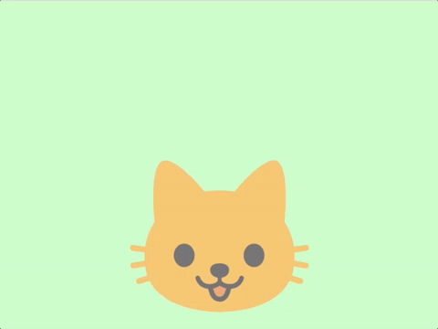

# LEARN GFX 2D

## Bouncing Kitten

This example renders a 2d sprite with transparency, and modify's the sprite's transform to make it move over time.

TODO: Write tutorial

The cat emoji used as an image is part of Google's [noto-emoji](https://github.com/googlei18n/noto-emoji) project and is licensed under [Apache 2.0](https://github.com/googlei18n/noto-emoji/blob/master/LICENSE).
