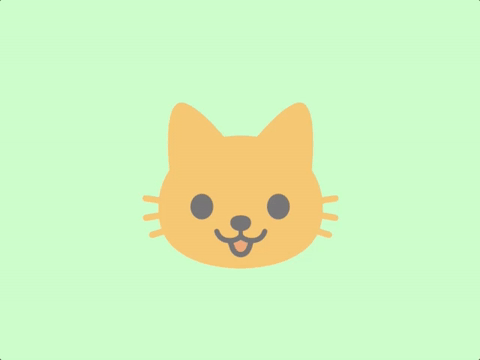

# LEARN GFX 2D

## Kitten Keyboard

A basic example which renders a sprite and allows the user to move it around with the arrow keys.

TODO: Write tutorial

The cat emoji used as an image is part of Google's [noto-emoji](https://github.com/googlei18n/noto-emoji) project and is licensed under [Apache 2.0](https://github.com/googlei18n/noto-emoji/blob/master/LICENSE).
