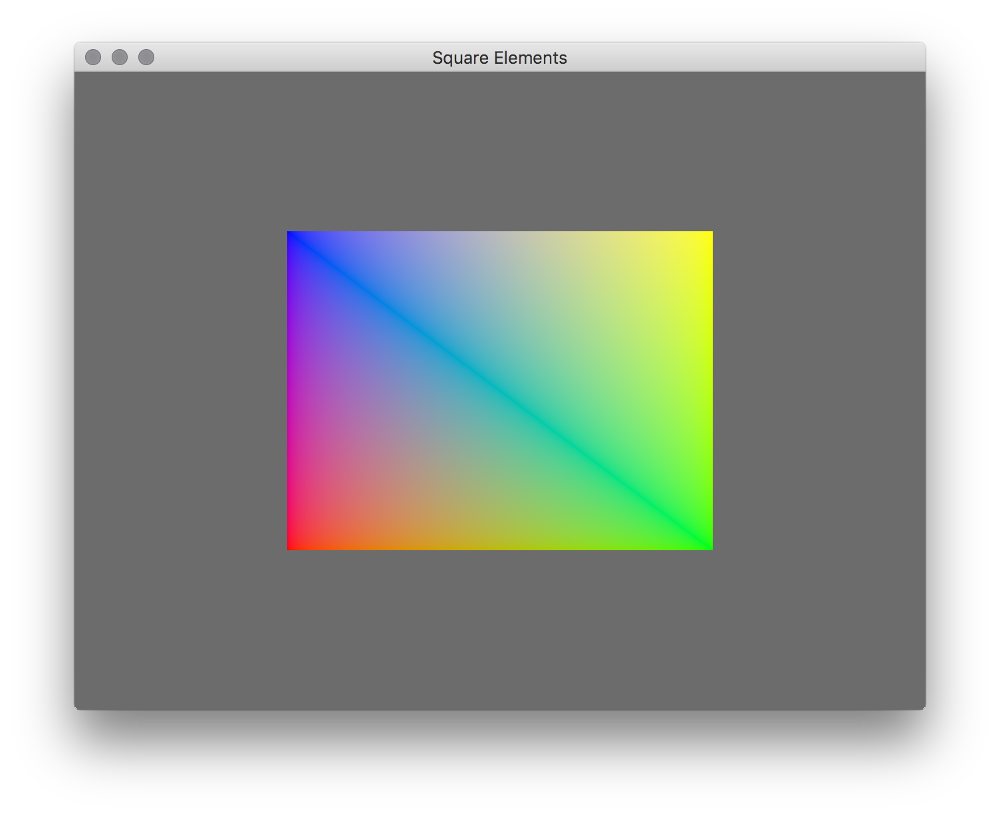

# LEARN GFX 2D

## Square Elements

This is a similar example as the square_interpolated example, but instead specifies element indices so that we only need to specify four vertices, instead of six.

TODO: Write tutorial

