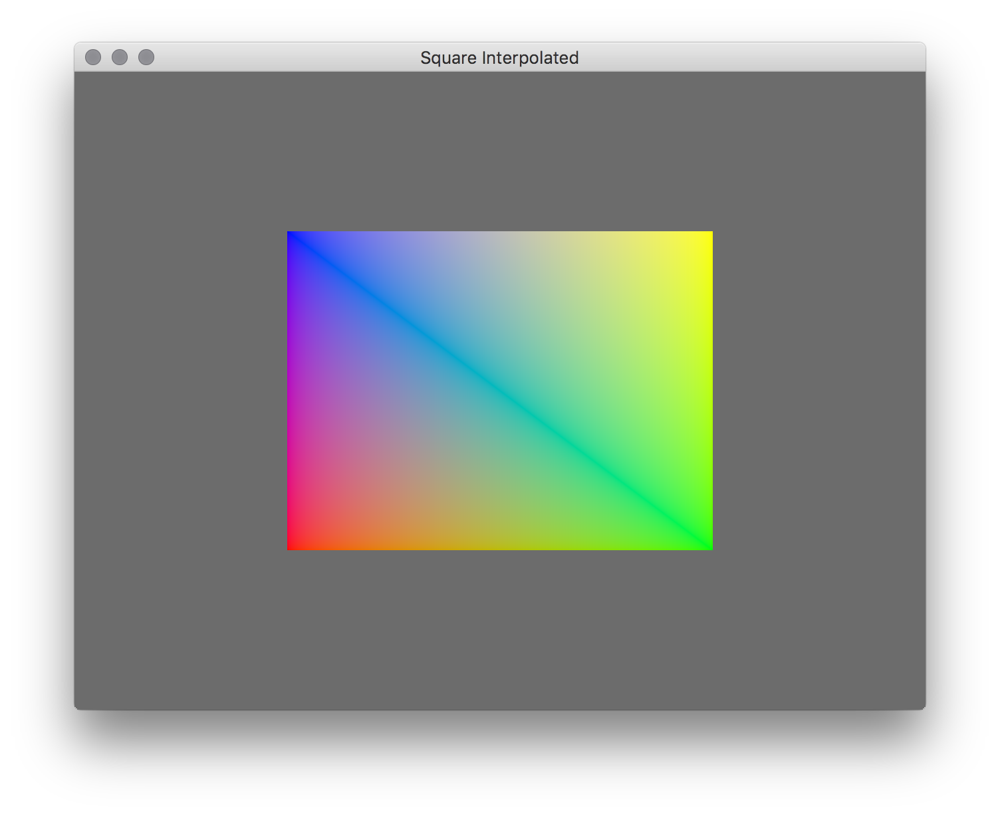

# LEARN GFX 2D

## Square Interpolated

This example renders a simple 2d square consisting of one four colors, one at
each point. The color is interpolated by the fragment shader the further in the
triangle the individual pixels go.

TODO: Write tutorial

